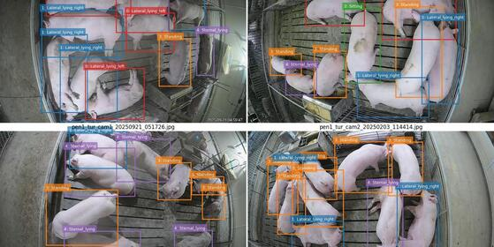

PigPose
=======

Compact training code for the Kaggle multi-view pig posture challenge.



The current training path intentionally favors a simple strong baseline over
experiment orchestration. It trains a ConvNeXt-Tiny crop classifier by default with:

- bbox crop input plus low-resolution full-image context,
- camera and target/source sensor-pen-domain metadata embeddings,
- metadata embedding dropout with timestamp metadata intentionally disabled,
- target-domain balanced batches from `train2_test_domain_images.csv`,
- class-balanced source sampling weighted by similarity to labeled target and unlabeled test rows,
- optional pseudo-label training from generated `Data/pseudo_labels/...` artifacts,
- checkpoint selection with validation TTA policy selection matching submission TTA,
- focal loss, target-domain loss upweighting, and target-prior logit adjustment,
- checkpoint selection on target-domain validation macro-F1,
- optional validation-calibrated class-bias offsets for submission logits,
- horizontal-flip label correction for left/right lying classes,
- optional test-time augmentation for submission generation.

Train and write a submission:

```bash
uv run python scripts/train.py
```

Precompute LAB tone statistics for source-to-target augmentation:

```bash
uv run python scripts/precompute_tone_stats.py
```

Useful options:

```bash
uv run python scripts/train.py --accelerator cpu --num-workers 0 --limit-samples 512
uv run python scripts/train.py --target-fraction 0.5
uv run python scripts/train.py --batch-size 64 --max-epochs 120
uv run python scripts/train.py --use-pseudo-labels --pseudo-label-dir Data/pseudo_labels/20260430_153000
uv run python scripts/train.py --validation-fold-index 1
uv run python scripts/train.py --validation-fold-count 0
```

Create pseudo labels from the best available checkpoints:

```bash
uv run python scripts/create_pseudo_labels.py
```

This writes `pseudo_labels.csv`, `logits.pt`, and `summary.json` below
`Data/pseudo_labels/YYYYMMDD_HHMMSS/`.

Create a submission from an existing checkpoint:

```bash
uv run python scripts/create_submission.py --checkpoint outputs/train/20260430_153000/checkpoints/last.ckpt
```

Standalone submission generation defaults to
`outputs/submissions/YYYYMMDD_HHMMSS/T2_ensemble_submission.csv`. Submission
filenames are normalized to start with `T2_`, so `--output
outputs/submissions/manual/submission.csv` writes
`outputs/submissions/manual/T2_submission.csv`.

Run TensorBoard:

```bash
uv run python scripts/run_tensorboard.py
uv run python scripts/run_tensorboard.py --list
```

Each training invocation writes a fresh timestamped run directory below the
configured output group. By default that looks like
`outputs/train/YYYYMMDD_HHMMSS/`:

- `checkpoints/`
- `tensorboard/`
- `metrics_summary.json`
- `run_summary.json`
- `T2_submission.csv`

`scripts/create_submission.py` discovers `run_summary.json` files recursively
below `outputs/`, and `scripts/run_tensorboard.py` watches `outputs/` by
default so newly created TensorBoard runs appear without restarting it.
